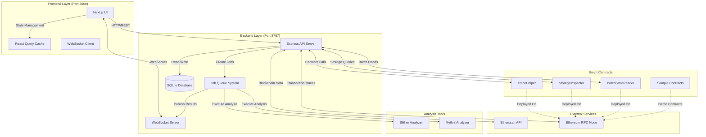
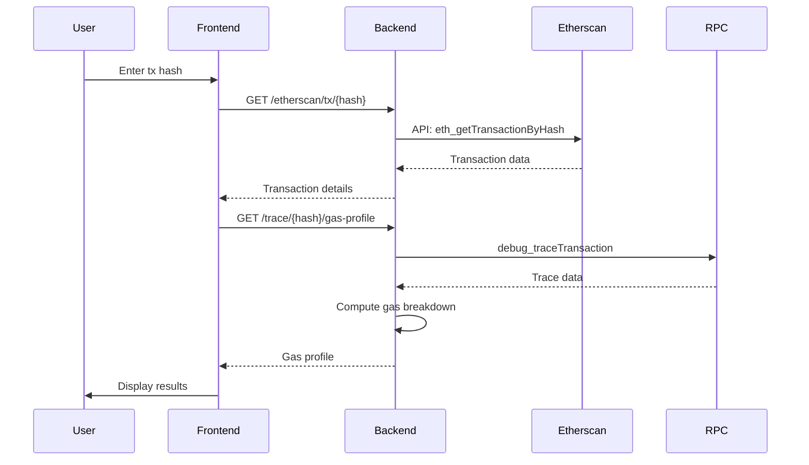
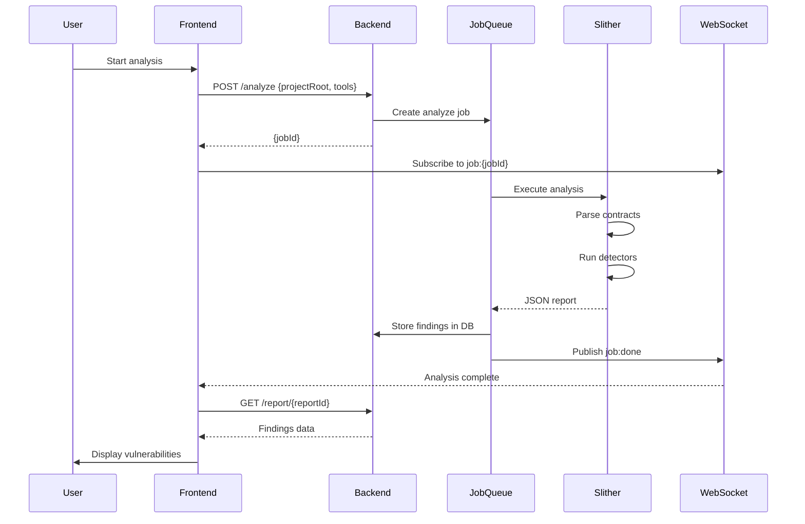
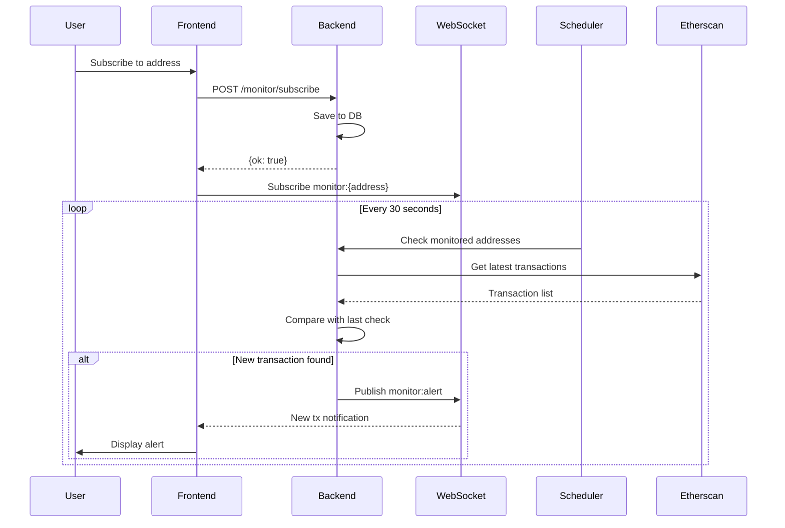

# EtherScope Architecture Documentation

## Table of Contents
1. [System Overview](#system-overview)
2. [Architecture Diagram](#architecture-diagram)
3. [Component Descriptions](#component-descriptions)
4. [Data Flow](#data-flow)
5. [Technology Stack](#technology-stack)
6. [Deployment Architecture](#deployment-architecture)

---

## System Overview

EtherScope is a comprehensive EVM transaction debugging and analysis platform designed to help developers understand smart contract execution, identify vulnerabilities, and optimize gas consumption. The system follows a three-tier architecture:

- **Frontend Tier**: Next.js web application providing the user interface
- **Backend Tier**: Express.js API server handling business logic and data processing
- **Blockchain Tier**: On-chain helper contracts and Ethereum network integration

### Key Capabilities

1. **Transaction Analysis**: Detailed trace execution, internal transactions, and event log decoding
2. **Vulnerability Detection**: Static analysis using Slither and Mythril
3. **Gas Profiling**: Gas consumption breakdown and optimization recommendations
4. **State Inspection**: Storage slot analysis and state diff visualization
5. **Real-time Monitoring**: WebSocket-based contract activity tracking

---

## Architecture Diagram



---

## Component Descriptions

### 1. Frontend Components (`frontend/`)

#### 1.1 Core UI Framework
- **Framework**: Next.js 14 with App Router
- **Styling**: Tailwind CSS for responsive design
- **State Management**: React Query (`@tanstack/react-query`) for server state

#### 1.2 Feature Components

| Component | Path | Description |
|-----------|------|-------------|
| Tx Lookup | `components/tx/TransactionLookup.tsx` | Transaction search and display |
| Block Explorer | `components/blocks/BlockExplorer.tsx` | Block navigation and transaction list |
| Contract Analysis | `components/contract/ContractAnalysis.tsx` | Contract source code viewer and analyzer |
| Analyzer | `components/analyzer/AnalyzerSection.tsx` | Local project static analysis |
| Findings | `components/findings/FindingsSection.tsx` | Vulnerability findings browser |
| Gas Trends | `components/trends/GasTrendsSection.tsx` | Historical gas usage charts |
| Monitor | `components/monitor/MonitorSection.tsx` | Real-time contract monitoring |
| Wallet | `components/wallet/WalletConnect.tsx` | MetaMask integration |

#### 1.3 API Client (`lib/api/client.ts`)
- RESTful API wrapper with TypeScript types
- WebSocket client with automatic reconnection
- Channel-based subscription system

### 2. Backend Components (`backend/`)

#### 2.1 API Server (`src/server.ts`)
- **Framework**: Express.js
- **Port**: 8787
- **Features**: CORS, JSON parsing, WebSocket upgrade

#### 2.2 Route Modules (`src/routes/`)

| Route | Endpoint | Purpose |
|-------|----------|---------|
| Health | `GET /health` | Service health check |
| Analyze | `POST /analyze` | Start static analysis job |
| Transaction | `GET /tx/:hash/*` | Transaction data and traces |
| Trends | `GET /trends` | Gas usage historical data |
| Monitor | `POST /monitor/*` | Subscribe/unsubscribe monitoring |
| Etherscan | `GET /etherscan/*` | Blockchain data proxy |
| Trace | `GET /trace/:hash/*` | Transaction trace analysis |

#### 2.3 Services (`src/services/`)

**EtherscanService** (`etherscanService.ts`)
- Fetches transaction, block, and contract data from Etherscan API
- Handles rate limiting and error responses
- Caches frequently accessed data

**TraceService** (`traceService.ts`)
- Decodes transaction traces and internal transactions
- Computes gas profiles by call
- Generates state diffs from storage changes

**AnalyzeService** (`analyzeService.ts`)
- Invokes Slither/Mythril via child processes
- Parses JSON output and normalizes findings
- Stores results in database

**MonitorService** (`monitorService.ts`)
- Manages monitored address subscriptions
- Polls for new transactions (job-based)

#### 2.4 Job System (`src/jobs/`)

**Architecture**:
- In-memory job queue with status tracking
- Job handlers registered at startup
- Publishes progress via WebSocket

**Job Types**:
1. **Analyze Job** (`analyzeJob.ts`): Runs static analysis tools
2. **Monitor Job** (`monitorJob.ts`): Polls blockchain for new transactions

#### 2.5 Database (`src/db/`)
- **Technology**: SQLite with better-sqlite3
- **Location**: `backend/data/backend.sqlite`

**Schema**:
```sql
-- Analysis results
CREATE TABLE reports (
  id TEXT PRIMARY KEY,
  txHash TEXT,
  timestamp INTEGER,
  findings TEXT,  -- JSON
  gasProfile TEXT -- JSON
);

-- Gas trends
CREATE TABLE gas_trends (
  id INTEGER PRIMARY KEY AUTOINCREMENT,
  contract TEXT,
  timestamp INTEGER,
  gasUsed INTEGER,
  txHash TEXT
);

-- Monitored addresses
CREATE TABLE monitored_addresses (
  id TEXT PRIMARY KEY,
  address TEXT UNIQUE,
  createdAt INTEGER
);
```

#### 2.6 WebSocket Server (`src/ws/wsServer.ts`)
- Upgrade HTTP connections to WebSocket
- Topic-based pub/sub system
- Broadcasts job progress and monitor alerts

### 3. Smart Contracts (`contracts/`)

#### 3.1 Analyzer Contracts (`src/analyzer/`)

**TraceHelper.sol**
- **Purpose**: Proxy execution with trace event emission
- **Key Functions**:
  - `proxyCall(target, data, value)`: Execute single call with events
  - `batchProxyCall(targets[], data[], values[], stopOnError)`: Execute multiple calls
  - `label(name)`: Emit custom debug label
- **Events**: `CallStarted`, `CallEnded`, `Label`
- **Gas Cost**: ~81,534 gas per call

**StorageInspector.sol**
- **Purpose**: Compute storage slots for complex data structures
- **Key Functions**:
  - `mappingSlotAddr(baseSlot, key)`: Compute mapping slot
  - `nestedMappingSlot(baseSlot, key1, key2)`: Nested mappings
  - `dynamicArraySlot(baseSlot)`: Array starting slot
  - `getEIP1967Implementation(proxy)`: Read proxy implementation
- **Gas Cost**: ~631 gas per mapping lookup

**BatchStateReader.sol**
- **Purpose**: Batch-read balances and allowances in single call
- **Key Functions**:
  - `getEthBalances(accounts[])`: ETH balances
  - `getTokenBalances(queries[])`: ERC-20 balances
  - `getAllowances(queries[])`: ERC-20 allowances
- **Gas Cost**: ~6,635 gas for 3 accounts

#### 3.2 Sample Contracts (`src/samples/`)

**VulnerableVault.sol**
- Intentionally vulnerable contract for testing detection
- Contains: Reentrancy, unchecked calls, missing access control, dangerous delegatecall

**SafeVault.sol**
- Secure implementation with best practices
- Features: Reentrancy guard, checks-effects-interactions, access control

**GasHog.sol**
- Demonstrates gas-inefficient patterns
- Provides optimized comparison versions

---

## Data Flow

### 1. Transaction Analysis Flow



### 2. Static Analysis Flow



### 3. Real-time Monitoring Flow



---

## Technology Stack

### Frontend
- **Framework**: Next.js 14.2.18 (React 18)
- **Language**: TypeScript 5.x
- **Styling**: Tailwind CSS 3.4
- **Charts**: Victory 36.9 (D3-based)
- **State**: React Query 5.62
- **Wallet**: ethers.js (via browser extension)

### Backend
- **Runtime**: Node.js 18+
- **Framework**: Express.js 4.x
- **Language**: TypeScript 5.x
- **Database**: SQLite (better-sqlite3)
- **WebSocket**: ws 8.x
- **API Integration**: Etherscan API, Ethereum JSON-RPC

### Smart Contracts
- **Language**: Solidity 0.8.28
- **Framework**: Foundry (forge, cast, anvil)
- **Testing**: Forge test with Foundry cheatcodes
- **Libraries**: forge-std

### Development Tools
- **Monorepo**: pnpm workspaces
- **Static Analysis**: Slither, Mythril
- **Code Quality**: ESLint, Prettier (frontend)

---

## Deployment Architecture

### Local Development Setup

```
┌─────────────────────────────────────────────┐
│  Developer Machine                          │
│                                             │
│  ┌─────────────┐      ┌─────────────┐     │
│  │  Frontend   │      │  Backend    │     │
│  │  :3000      │─────▶│  :8787      │     │
│  └─────────────┘      └─────────────┘     │
│                              │              │
│                              ▼              │
│                       ┌─────────────┐      │
│                       │   SQLite    │      │
│                       └─────────────┘      │
└─────────────────────────────────────────────┘
                          │
                          ▼
              ┌──────────────────────┐
              │  External Services   │
              │  • Etherscan API     │
              │  • Ethereum RPC      │
              └──────────────────────┘
```

### Production Deployment (Recommended)

```
┌──────────────┐
│   Browser    │
└──────┬───────┘
       │
       ▼
┌──────────────────────────────────┐
│  Next.js Frontend (Vercel)       │
│  • Static generation             │
│  • Edge functions                │
└────────┬─────────────────────────┘
         │
         ▼
┌──────────────────────────────────┐
│  Backend API (Cloud VM / Docker) │
│  • Express server                │
│  • WebSocket server              │
│  • Job queue                     │
└────────┬─────────────────────────┘
         │
    ┌────┴────┬─────────────┐
    ▼         ▼             ▼
┌────────┐ ┌────────┐ ┌──────────┐
│ SQLite │ │Slither │ │Etherscan │
└────────┘ └────────┘ └──────────┘
```

### Environment Configuration

**Frontend** (`.env.local`):
```bash
NEXT_PUBLIC_API_URL=http://localhost:8787
NEXT_PUBLIC_WS_URL=ws://localhost:8787
```

**Backend** (`.env`):
```bash
PORT=8787
ETHERSCAN_API_KEY=your_api_key_here
DB_PATH=./data/backend.sqlite
TOOL_PATH_EXTRA=/usr/local/bin:/opt/homebrew/bin
```

**Contracts** (`.env`):
```bash
SEPOLIA_RPC_URL=https://sepolia.infura.io/v3/YOUR_KEY
PRIVATE_KEY=your_private_key
ETHERSCAN_API_KEY=your_api_key
```

---

## Security Considerations

### 1. Input Validation
- All user inputs (addresses, hashes) validated with regex
- Project paths sanitized to prevent path traversal
- Contract addresses checksummed

### 2. Rate Limiting
- Etherscan API calls throttled to prevent rate limit
- Job queue prevents resource exhaustion

### 3. Process Isolation
- Static analysis tools run in child processes
- Timeout enforcement prevents hanging processes

### 4. Data Privacy
- No private keys stored
- Analysis results stored locally in SQLite
- Optional data retention policies

### 5. Dependency Security
- Regular dependency updates
- No known vulnerabilities in production dependencies
- Minimal attack surface with focused dependencies

---

## Performance Characteristics

### Response Times (Typical)
- Transaction lookup: 200-500ms (Etherscan API latency)
- Gas profile generation: 1-3s (RPC trace call)
- Static analysis: 10-60s (depending on contract size)
- WebSocket message delivery: <50ms

### Resource Usage
- Frontend bundle: ~800KB gzipped
- Backend memory: 50-100MB idle, 200-500MB during analysis
- SQLite database: ~10MB per 1000 analysis reports

### Scalability
- Frontend: Stateless, horizontally scalable
- Backend: Vertically scalable, job queue can be distributed
- Database: SQLite suitable for <10K reports, migrate to PostgreSQL for larger scale

---

## Future Enhancements

1. **Distributed Job Queue**: Redis-backed queue for horizontal scaling
2. **Contract Interaction Graph**: Visual dependency mapping
3. **Historical State Replay**: Time-travel debugging
4. **Multi-chain Support**: Polygon, Arbitrum, Optimism
5. **API Rate Limiting**: Per-user quotas
6. **Authentication**: User accounts with saved analyses

---

## References

- [Etherscan API Documentation](https://docs.etherscan.io/)
- [Ethereum JSON-RPC Specification](https://ethereum.github.io/execution-apis/api-documentation/)
- [Slither Documentation](https://github.com/crytic/slither)
- [Foundry Book](https://book.getfoundry.sh/)
- [Next.js Documentation](https://nextjs.org/docs)
